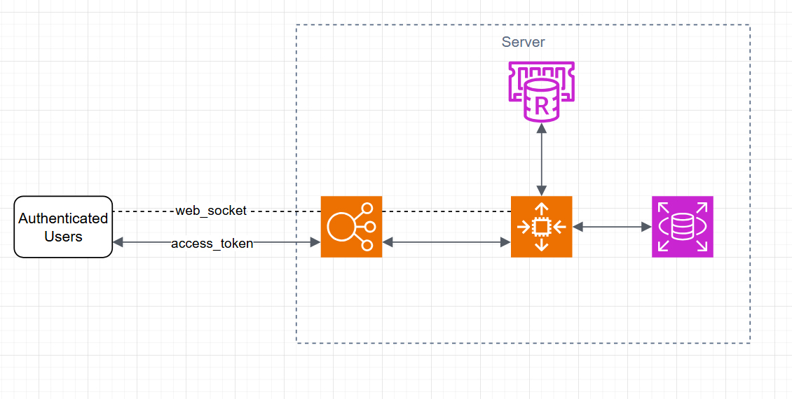

# Problem 6: Architecture

The specification documentation for Real-time Scoreboard, live update top 10 user’s scores

## 1. Requirements

### Functional Requirements

- A website with a score board, which shows the top 10 user’s scores.
- Live update of the score board.
- User can do an action (which we do not need to care what the action is), completing this action will increase the user’s score.
- Upon completion the action will dispatch an API call to the application server to update the score.
- Prevent malicious users from increasing scores without authentication.

### Non-Functional Requirements

- High availability
- Low latency (live update)
- Scalability
- Reliability

### To be determined (Project requirements uncertainties)

- How many users will use this system? Max concurrent users?
- Are the users distributed across the globe?
- Read:write ratio
- Are the actions that users perform grouped? (example: leaderboards by games, leaderboards by friend groups, leaderboards by country...)
- Budget for project
- ...

> Because many requirements have not been clearly defined, ideally, assumptions should be made to design. However, I will provide the most general design approach, which only needs slight updates to be applicable to many cases.

## 2. Over all architecture

_Redis with zset is ideal for applications that require continuous leaderboard updates and can quickly retrieve data in order or score ranges. Also, it can handle loads up to millions. So the core of the system will be around Redis_

### Key Components

#### Redis

- Use Redis to store the leaderboard, with a **Sorted Set** data structure
- For further, **Publish/Subscribe (Pub/Sub)** in Redis will be used to notify services or user interfaces when there are new updates.

#### Backend (NodeJS)

- **RESTful API** to provide endpoints for manipulation, from which to calculate scores, retrieve leaderboard
- We can implement **WebSocket** or **Server-Sent Events (SSE)** to provide real-time updates to users when they do an action.

#### Database

- NoSQL (MongoDB) or PostgreSQL (SQL) is used to store user data, or later information about score board.



_For high availability and scalability, we use `Load Balancer` + `Auto Scaling Group`, also need read replicas or `Redis cluster` to meet these general requirements_

## 3. API specification

### Update User Score _`[POST] /api/score/update`_

_This API allows users to complete an action which results in their score being incremented. The system will update the user's score based on the completion of the action._

**Request**

- URL: `/api/score/update`
- Method: `POST`
- Request Headers: `Authorization` : `Bearer <JWT Token>`
- Request Body:
  ```sh
  {
      "user_id": "user123",      // User's ID
      "points_earned": 50        // Points earned for completing the action
  }
  ```

**Response**

- Status Code: `200 OK` (on success) or 400 Bad Request (on error).
- Response Body:
  ```sh
  {
      "message": "Score updated successfully",
      "user_id": "user123",
      "new_score": 150         // Updated score after adding the earned points
  }
  ```

**Explanation**

- _Action Completion_: This endpoint reflects that a user has completed an action, but the action's details are not important to the API. What matters is the number of points earned as a result of completing the action (`points_earned`).
- _Score Update_: The API receives the `user_id` and `points_earned` from the client, increments the user's score accordingly, and returns a confirmation message along with the updated score.
- After the score is updated, the backend can send a WebSocket or SSE notification to notify other connected clients of the leaderboard update.

### Get Top 10 Users by Score _`[GET] /api/score/top`_

_This API allows the client to retrieve the top 10 users with the highest scores from the system._

**Request**

- URL: `/api/score/top`
- Method: `GET`
- Request Parameters: None.
- Request Headers: `Authorization` : `Bearer <JWT Token>`
- **Response**
- Status Code: `200 OK`
- Response Body:
  ```sh
  {
    "top_users": [
      {
        "user_id": "user001",
        "score": 1000
      },
      {
        "user_id": "user025",
        "score": 950
      },
      {
        "user_id": "user033",
        "score": 900
      },
      // ... (8 more users)
    ]
  }
  ```

**Explanation**

- This API returns the top 10 users with the highest scores. Data can be fetched from Redis using the `ZREVRANGE` command (getting the highest ranked elements from Redis ZSET).
- This information can be used to display the leaderboard to users.

### Get User's Score _`[GET] /api/score/self`_

_This API allows users to get their own score._

**Request**

- URL: `/api/score/self`
- Method: `GET`
- Request Parameters: None.
- Request Headers: `Authorization` : `Bearer <JWT Token>`

**Response**

- Status Code: `200 OK`
- Response Body:
  ```sh
  {
    "user_id": "user123",
    "score": 550
  }
  ```

**Explanation**

- This API accepts the Authorization token from the client to authenticate the user and return their score.
- If the user does not exist or has no score, return `404 Not Found`.

### Update Score via WebSocket (Auxiliary)

_To notify other clients about score changes after a user updates their score via the API, you can use WebSocket to send notifications._

WebSocket: Broadcast leaderboard update (message: leaderboard_update).
When the user updates their score via the `/api/score/update` API, the backend will send a notification via WebSocket to all connected clients about the leaderboard change.

**WebSocket Message Format:**

```sh
{
  "event": "leaderboard_update",
  "data": {
    "user_id": "user123",
    "new_score": 100
  }
}
```

**Explanation:**

- Each time a user's score changes, WebSocket sends a notification to all connected clients, allowing them to `update the leaderboard` instantly.
- The structure of the notification may include `user_id` and `new_score` so that clients can update the relevant information.

### Security Considerations

- **Authentication**: Need to pay attention to `/api/score/self` API requires valid JWT token to ensure they can only access their own score.
- **Rate Limiting**: To avoid abuse of the API, you can implement rate limiting on APIs like `/api/score/update` and `/api/score/top`.
- **Data Validation**: Ensure that the score being updated is valid and that users cannot submit incorrect data (example: score must be a positive number).

### API Specification Summary

| Method      | Endpoint             | Description                      |
| ----------- | -------------------- | -------------------------------- |
| `POST`      | `/api/score/update`  | Update the user's score          |
| `GET`       | `/api/score/top`     | Get the top 10 users by score    |
| `GET`       | `/api/score/self`    | Get user's score                 |
| `WebSocket` | `leaderboard_update` | Broadcast leaderboard updates to |

## 4. More about Redis `ZSET`

### Features

- **Ordered**: Elements are stored in a specific order based on a score.
- **Unique Elements**: Each element has a unique member, but can have the same score.
- **Efficient Range Queries**: Supports range queries by score or rank.
- **Sorted by Score**: Automatically sorted by the score (ascending or descending).
- **O(log(N)) Operations**: Insertion, removal, and rank queries are fast (logarithmic complexity).
- **Score-Based Ranking**: Elements are ordered based on a floating-point. score

### Basic `ZSET` commands

- `ZADD`: Add one or more elements to the zset, with the score value.
- `ZRANGE`: Get the elements in a given range, which can be sorted in ascending or descending order.
- `ZREM`: Remove one or more elements from the zset.
- `ZCARD`: Get the number of elements in the zset.
- `ZSCORE`: Get the score of an element in the zset.
- `ZRANK`: Get the rank of an element in the zset (based on the score).

### Apply to project

- Insert/update user score
  ```sh
  ZADD leaderboard 1000 "player1" 1500 "player2" 2000 "player3"
  ```
- Get top 10 score:
  ```sh
  ZREVRANGE leaderboard 0 9 WITHSCORES
  ```
- Get user score:
  ```sh
  ZRANK leaderboard "player2"
  ```
- Get rank of users in range score:
  ```sh
  ZRANGEBYSCORE leaderboard 1000 2000
  ```
